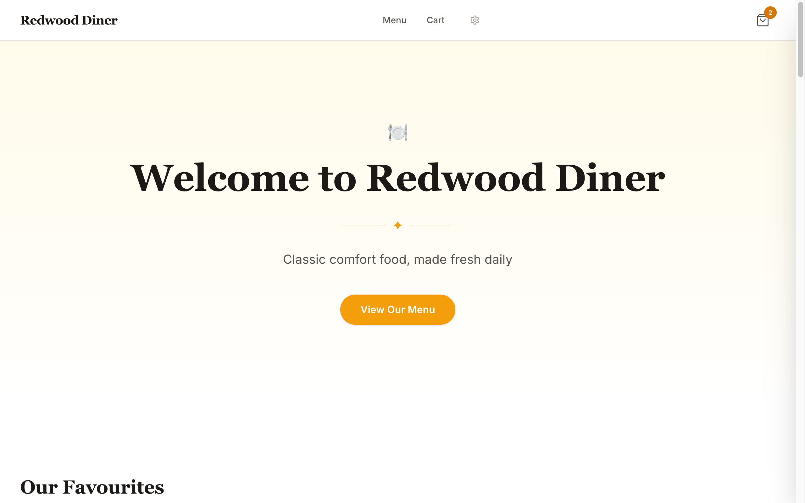
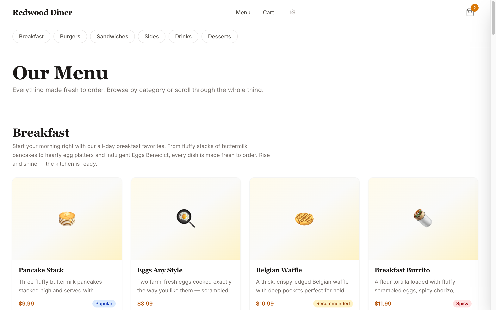
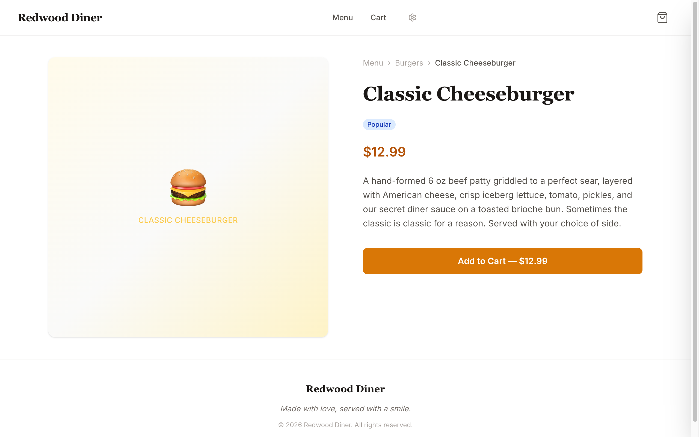
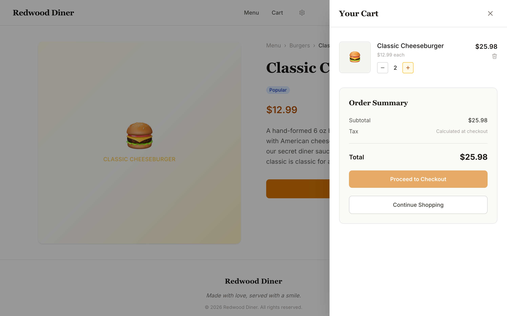

# Redwood Diner


[](https://redwoodjs.com)
[](https://tailwindcss.com)
[](https://www.typescriptlang.org)
[](https://react.dev)
[](LICENSE)

A classic American diner menu and ordering app — browse the full menu, customise your order, and check out. Built with RedwoodJS, Tailwind CSS, and TypeScript.

<br>

<p align="center">
  
</p>

## Features

- **Full diner menu** — Breakfast, Burgers, Sandwiches, Sides, Drinks, and Desserts with rich descriptions and pricing
- **Product detail pages** — Individual pages for each item with emoji art, badges, variants, and Add to Cart
- **Shopping cart** — Slide-out cart drawer with quantity controls, order summary, and persistent state via sessionStorage
- **"Describe Your Own"** — Custom product forms in every category for creative orders
- **Category navigation** — Anchor-linked category nav on the menu page for fast browsing
- **Badge system** — Popular, Recommended, New, Spicy, and Vegetarian labels on menu items
- **Theme configurator** — Built-in design tool for customising colors, typography, and spacing
- **Responsive layout** — Clean, mobile-friendly UI powered by Tailwind CSS

## Screenshots

### Menu

<p align="center">
  
</p>

### Product Detail

<p align="center">
  
</p>

### Cart Drawer

<p align="center">
  
</p>

## Quick Start

```bash
# Clone the repo
git clone https://github.com/stussysenik/redwood-shopify-e-commerce.git
cd redwood-shopify-e-commerce

# Install dependencies
yarn install

# Start the dev server
yarn rw dev
```

The app will be running at [http://localhost:8910](http://localhost:8910).

## Tech Stack

| Layer | Technology |
|-------|-----------|
| Framework | [RedwoodJS](https://redwoodjs.com) 8.6 |
| Frontend | React 18 |
| Styling | Tailwind CSS 4 |
| Language | TypeScript (strict) |
| Build | Vite |
| Testing | Cypress |
| Data | Mock data (client-side) |

## Project Structure

```
redwood-shopify-e-commerce/
├── web/src/
│   ├── Routes.tsx              # All app routes
│   ├── context/                # Cart state (React Context + useReducer)
│   ├── data/                   # Mock products & collections
│   ├── hooks/                  # useCart, useMenu
│   ├── layouts/DinerLayout/    # Header, Footer, CartDrawer wrapper
│   ├── pages/                  # Home, Menu, ProductDetail, Cart, etc.
│   ├── components/
│   │   ├── layout/             # Header, Footer, CartDrawer
│   │   ├── menu/               # MenuItemCard, CategoryNav, FeaturedItems
│   │   ├── product/            # ProductDetail, ProductImage, ProductPrice
│   │   ├── cart/               # CartMain, CartLineItem, CartSummary
│   │   ├── ui/                 # Hero, Badge, EmptyState
│   │   └── dev/                # ThemeConfigurator, ColorPicker
│   └── types/                  # Product, Collection, Cart, Theme types
├── api/src/                    # GraphQL API (RedwoodJS)
└── redwood.toml                # RedwoodJS config
```

## License

MIT
